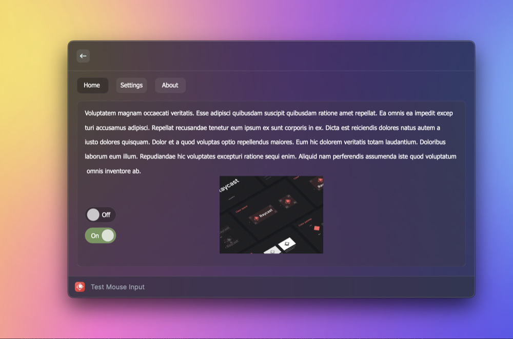

# clickable-detail

A customized Detail component for Raycast that enables interaction via mouse clicks.



## Installation

```bash
npm install clickable-detail
```

> Upon install, the package will automatically add two `.scpt` scripts to your extension's `assets` folder, i.e.:
> 
> - [DetectMouseClicks](./bin/DetectMouseInput.scpt) - Used to detect mouse clicks on the Raycast window.
> - [HTML2b64](./bin/HTML2b64.scpt) - Used to convert HTML and URLs to base64-encoded PNG strings.
>
> These scripts are necessary for the package to work, but you can modify them if you wish (e.g. if you want to customize the SVG that is used to render the clickable content). Use Script Editor on your Mac to view/edit the source code.


## Usage

### Overview

```tsx
import {
  ClickableDetail,
  DynamicSVG,
  HTML,
  INPUT,
  Image,
  Polygon,
  Toggle,
  usePreloadedImages,
  useToggleDelegate,
} from "clickable-detail";
import { runAppleScript } from "run-applescript";

export default function Command() {
  // Preload images so they are ready to be used when the SVG is rendered
  const images = usePreloadedImages(["https://placeholder.pics/svg/200x100"]);

  // Delegates are used to keep track of state
  const toggleDelegate = useToggleDelegate(false);

  return (
    <ClickableDetail isLoading={images.length != 1} waitUntilAllLoaded={true}>
      <DynamicSVG>
        {/* High-level, stateful components provided (More to be added soon) */}
        <Toggle
          x={0}
          y={0}
          delegate={toggleDelegate}
          label="Option 1"
          onClick={() => runAppleScript(`display dialog "You toggled Option 1"`)}
        />

        {/* Include external images */}
        <Image x={0} y={50} width={200} height={100} {...images[0]?.image.data} />

        {/* Click handlers can access the (x, y) coordinate of the click */}
        <Polygon points="300,100 350,25 350,75 400,0" fill="red" onClick={(loc) => console.log(`Clicked at (${loc.x}, ${loc.y})`)}/>

        {/* Supports HTML using JSX syntax */}
        <HTML y={200}>
          <head>
            {/* Supports applying styles to HTML elements */}
            <style type="text/css">
              {`
                #paragraph1 {
                  color: red;
                }
              `}
            </style>
          </head>
          <body>
            {/* Use React's built-in HTML components */}
            <p id="paragraph1">Can render arbitrary HTML content</p>

            <form>
              {/* For additional functionality, use package-provided components -- just uppercase the normal tag and add, e.g., a click handler */}
              <INPUT type="submit" value="Submit" onClick={() => console.log("Submitted!")} x={10} y={215} width={55} height={25} />
            </form>
          </body>
        </HTML>
      </DynamicSVG>
    </ClickableDetail>
  );
}
```

The `ClickableDetail` component works similarly to the built-in `Detail` component, but with a few key differences:

- You do not provide a `markdown` prop — it will be automatically generated from `ClickableDetail`'s children.
- As of now, the `metadata` prop is not supported, but will be in the future.


## How does it work?

There two two main aspects to this package:

1. Rendering clickable content
2. Listening for mouse clicks

For the first part, the `ClickableDetail` component uses a dynamically generated SVG to display content beyond what Detail normally supports. The SVG can be sourced from anywhere, but the provided [DynamicSVG](./lib/DynamicSVG.tsx), built specifically for this package, is highly recommended. It supports not just creating SVGs using JSX syntax, but also embedding HTML content, external URLs, and click handlers for SVG elements.

To enable mouse clicks, the `ClickableDetail` component uses a JXA child process to monitor mouse clicks on the Raycast window. When a click is detected, `ClickableDetail` will determine if the click was on an SVG element that has a click handler. If so, the click handler will be called.